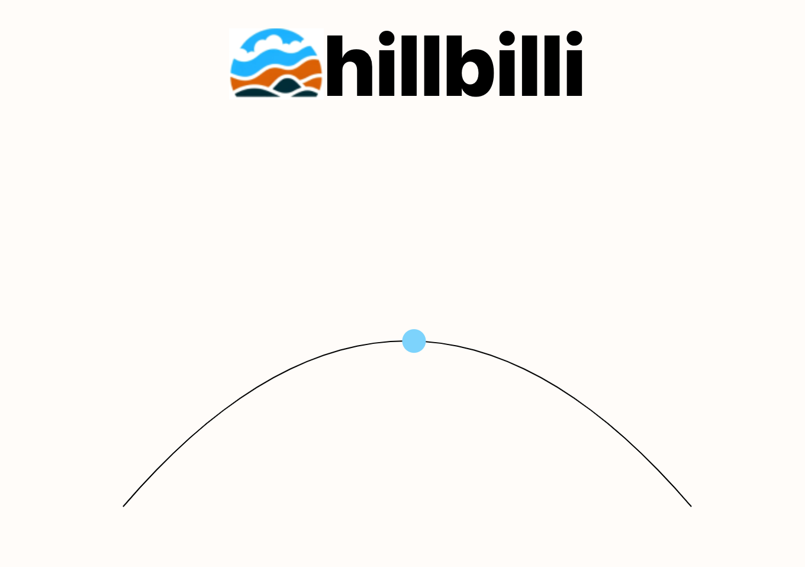

# hillbilli

A simple [hillchart](https://basecamp.com/shapeup/3.4-chapter-13#work-is-like-a-hill) component which can programmatically updated.

## gettings started 

- clone the repo
- run `npm install`
- run `npm run dev`

